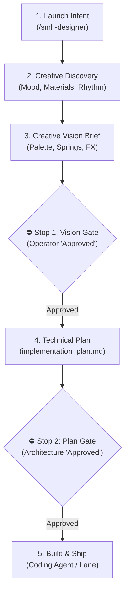

# 🦋 design-engineer-skills

**A Lead Design Engineer for your coding agent.** Ten interlocking skills and one command that turn
an agent into a front-end craftsman: design systems, Apple spring physics, WebGPU shaders, optical
liquid glass, React Three Fiber scenes, and native mobile motion.

The front door is **`/smh-designer`**, which activates **🦋 Caterpillar** and runs a two-phase
*Creative Vision Lock* — it agrees the aesthetic direction with you **before** it writes a line of
code, then hands you an approved implementation plan.

---

## Install

Give your agent this repository URL and the sentence: **"clone this and follow the Setup section of
the README."** That is the whole install.

### Setup

> **Instructions for the installing agent.** Follow these steps exactly.
>
> 1. Clone this repository (or work from it if already cloned):
>    ```bash
>    git clone https://github.com/sudomadhatter/design-engineer-skills.git
>    cd design-engineer-skills
>    ```
> 2. Run `python3 verify.py` and confirm it reports **ALL CHECKS PASSED**. If it does not, stop and
>    report the failing rows to the operator — do not install a broken pack.
> 3. Identify where the operator's harness reads **skills** and **slash commands**. For Claude Code
>    these are `.claude/skills/` and `.claude/commands/` — project-level in the repo you are working
>    in, or user-level under `~/.claude/` to make it available everywhere. Ask the operator which
>    scope they want if it is not obvious. For other harnesses, use that harness's documented
>    locations; the contract is only that one directory holds skill folders and one holds command
>    markdown files.
> 4. Copy the contents of this pack's `skills/` into the skills directory, and `commands/` into the
>    commands directory. For Claude Code, project-level:
>    ```bash
>    mkdir -p .claude/skills .claude/commands
>    cp -r skills/* .claude/skills/
>    cp commands/smh-designer.md .claude/commands/
>    ```
> 5. Copy `docs/frontend_UI_design_guide.md` somewhere the agent can read it, and make sure the link
>    at the top of `commands/smh-designer.md` still resolves from where you put the command file. If
>    your layout differs from this pack's, **fix that one relative link** — it is the only path in the
>    pack that depends on layout.
> 6. Confirm to the operator that `/smh-designer` is available, and list the ten skills installed.
>
> **Do not** edit the skill bodies during install. If something does not fit the operator's harness,
> say so rather than improvising.

### Manual install

Copy `skills/*` into your harness's skills directory and `commands/smh-designer.md` into its commands
directory. `skills/smh-designer/SKILL.md` is a thin launcher that just points at the command body —
it exists so the same `/smh-designer` works in harnesses whose menus read skills rather than commands.

---

## What's inside

| Skill | What it gives the agent |
|---|---|
| [`smh-designer`](skills/smh-designer/SKILL.md) | The launcher for 🦋 Caterpillar. Real body lives in [`commands/smh-designer.md`](commands/smh-designer.md). |
| [`ui-ux-pro-max`](skills/ui-ux-pro-max/SKILL.md) | 67 styles, 96 palettes, 57 font pairings, 99 UX heuristics, per-stack guidelines. Searchable via `scripts/search.py`. |
| [`emil-design-eng`](skills/emil-design-eng/SKILL.md) | Motion craft — Apple 2-parameter springs, the 4-gate opportunity filter, sub-300ms budget, Before/After review tables. |
| [`vgpu`](skills/vgpu/SKILL.md) | WebGPU shaders — typed WGSL, fullscreen fluid meshes, interactive plasma, particle compute, headless CI adapters. |
| [`apple-glass`](skills/apple-glass/SKILL.md) | Mobile-first Apple frosted & liquid glass — Tier 1 CSS 180% saturation boost (120fps compositor), Tier 2 live DOM refraction via `@samasante/liquid-glass`, Tier 3 native `@callstack/liquid-glass` / SwiftUI `.glassEffect()`. Strict ban on desktop `html2canvas` and Three.js canvas hacks for 2D UI. Plus [`RECIPES.md`](skills/apple-glass/RECIPES.md). |
| [`border-beam`](skills/border-beam/SKILL.md) | Multi-tiered optical border beam engine — 1px sub-pixel razor stroke (`mask-composite`), inner/out glow, 32px Gaussian bloom, ~30fps rAF pulse driver, and 2D canvas AI Thinking Indicators. Plus [`THINKING_INDICATORS.md`](skills/border-beam/THINKING_INDICATORS.md) and live studio [`docs/development_diagrams/ui_effects_and_thinking_icons.html`](docs/development_diagrams/ui_effects_and_thinking_icons.html). |
| [`visual-fx-3d`](skills/visual-fx-3d/SKILL.md) | The Poimandres suite — R3F, Drei, Postprocessing, Rapier, glTF models, spatial 3D scenes (reserved for 3D meshes, not DOM UI). Plus [`CATALOG.md`](skills/visual-fx-3d/CATALOG.md) (100+ components) and [`RECIPES.md`](skills/visual-fx-3d/RECIPES.md). |
| [`webm-alpha-video`](skills/webm-alpha-video/SKILL.md) | Green-screen to transparent alpha WebM overlays. |
| [`animate-expo`](skills/animate-expo/SKILL.md) | React Native / Expo motion — Reanimated, Gesture Handler, haptics. |
| [`write-swift`](skills/write-swift/SKILL.md) | Native iOS / Swift. |
| [`docs/frontend_UI_design_guide.md`](docs/frontend_UI_design_guide.md) | The procedural manual tying all of it together. |

---

## Using it

Type `/smh-designer` with or without intent:

```
/smh-designer make the pricing page feel like frosted glass over a slow-moving aurora
```

**Phase 1** — Caterpillar interviews you on the visual emotion, the materials, and the interaction
rhythm, then presents a **Creative Vision Brief** (palette, typography, layout, motion curves, shader
specs) and **stops for your approval**.

**Phase 2** — the approved vision becomes a formal `implementation_plan.md`, and it **stops again**.

Then you hand that plan to whatever build lane you already use. `/smh-designer` is a *design* command,
not a build command — see *Adapting to your own lane* in
[`commands/smh-designer.md`](commands/smh-designer.md) for wiring it into a ticket tracker or straight
into a coding agent.

Without arguments it presents a capabilities menu — brainstorm, design system, fluid motion, WebGPU
shaders, 3D/spatial, physical glass, optical border glows, alpha video, design audit, or scaffold.

### Interactive visual walkthrough

Explore the complete interactive lifecycle diagram: **[`designer_workflow.html`](docs/development_diagrams/designer_workflow.html)** (compiled with Archify at 100% Showcase Profile):
- **Step-by-step trace:** Watch the prompt travel from Creative Discovery through the two approval gates to build hand-off.
- **Inspection cards:** Click any node to inspect rules, motion budgets, and failure recoveries.
- **Live studio catalog:** Open [`docs/development_diagrams/ui_effects_and_thinking_icons.html`](docs/development_diagrams/ui_effects_and_thinking_icons.html) to interact with live border beam presets and thinking indicators.



### The invariants it holds

These are non-negotiable in every response Caterpillar gives:

- **Mobile first, always.** Base CSS is the phone; `min-width` enhances outward. Never a `max-width`
  query that subtracts from a desktop baseline.
- **Mobile-first glass, always.** 120fps hardware-composited Tier 1 CSS/Tailwind (backdrop-filter + 180%
  saturation boost + specular rim highlight) for 95% of UI. Tier 2 live DOM refraction (`@samasante/liquid-glass`)
  for physical lenses. Strict ban on `html2canvas` and Three.js canvas hacks for 2D UI.
- **Optical border beam separation.** 3-tier sub-pixel stroke (`mask-composite: exclude`), inner/out glow,
  and Gaussian bloom driven by a shared ~30fps rAF pulse driver.
- **Dual-viewport verification.** Any spec asserting geometry runs at both a phone and a desktop size.
- **Sub-300ms UI budget**, `transform`/`opacity` only, **never `ease-in`**, never animate from
  `scale(0)`.
- **R3F on demand** — `frameloop="demand"`, `dpr={[1, 1.5]}`.
- **WebGPU fallback guard** — verify `navigator.gpu`, degrade to a CSS gradient.
- **Reduced motion** always has a static fallback.

---

## Verify

```bash
python3 verify.py
```

Checks that no absolute paths survived, every relative link resolves, the `ui-ux-pro-max` scripts
compile and return real results, and all ten skills are present at full file count. Standard library
only — no install step.

## Requirements

Python 3.8+ for the `ui-ux-pro-max` search scripts and `verify.py`. Nothing else — the rest is
markdown the agent reads. The libraries the skills *recommend* (R3F, Drei, Reanimated, etc.) are
installed per-project as the plans call for them.

## Credits & licence

Composition is MIT — see [LICENSE](LICENSE). It builds on work by Emil Kowalski, Poimandres, and
Vercel Labs; see [CREDITS.md](CREDITS.md).
